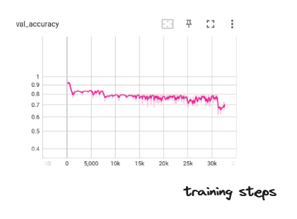

## Error correction code

Error correction code (https://en.wikipedia.org/wiki/Error_correction_code) is an important part of radio telecommunication network.

The idea of error correction code is to add redundancy in the original transmitted signal in order to be robust to signal corruption.

## Deep learning and transformer

One of the core development of the recent decade is the advent of deep learning and the transformer architecture.
Also one can think of the recent development around "discrete" latent representation of data like VQ VAE (https://arxiv.org/pdf/1711.00937.pdf) or FSQ (https://arxiv.org/abs/2202.01855).
One can exploit the powerful tools that is deep learning to try to create a proper (neural) error correction code software.

## The idea

The idea is to use a discrete code representation couple with clever transformer (permutation invariant architecture) to try to reproduce the performance of classic error correction code.

The "noise" box represent the environment noise that can corrupt the transmitted data.

## Experiences

The first experiences is simple :

Can you make an model that is just able to retrieve the information without any noise but with a discretization layer ?
The result of the first training : 
The answer is (obviously) yes but it takes some times :

But if we add (channel) noise after the discretization part it leads to instability (no convergence) :

And if instead of a discretization layer we add a normalized one (corresponding to power normalization), we obtain better resulting convergence :

R being the code rate.

We observe that an implicit modulation :

## The global neural architecture 

The global neural architecture is represented here :

